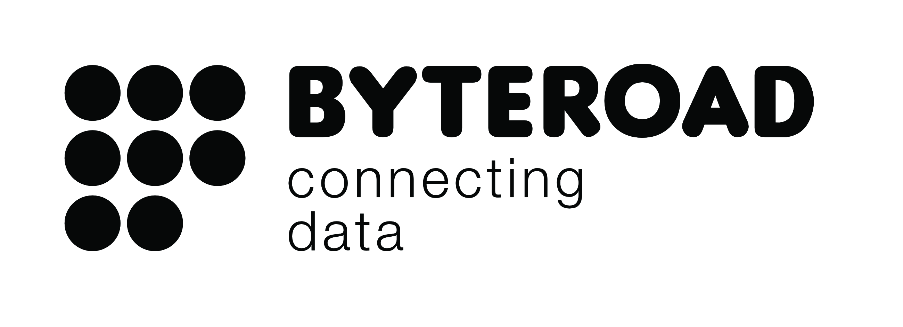

# WORKSHOP - Sharing data with the eMOTIONAL Cities SDI :open_hands:
This workshop introduces the tools that compose the
eMOTIONAL Cities GIS infrastructure. We will see how to share and
consume data through the classic W * OGC services and the latest OGC
Open API. During the workshop, we will see how to use client
applications, such as QGIS, to consume data from various endpoints.
Please read the [FAQ](#faq) section for more information.

This workshop was created by [ByteRoad](https://byteroad.net/), in the context of the [eMOTIONAL Cities](https://emotionalcities-h2020.eu/) project.

## Architecture and Technology Stack :desktop_computer:
An SDI is a set of tools and methodologies for storing and facilitating the use of geospatial data. The SDI of eMOTIONAL Cities favours using open source tools and open standards for data and service formats.

When we talk about standards, it's helpful to distinguish between two different categories:
Data: the formats by which data is stored in a computer: they can indicate a file with a particular format or a database.
Services: the standards by which data is shared and made accessible (which is not the same as giving access to raw data).

For *geospatial data*, the most popular formats are:

* Geographic database
* Vector files
* Raster files

The most widely used open standards for *services* are those defined by the Open Geospatial Consortium (OGC).
The most commonly used standards to date are those of OGC Web Services (OWS).
Still, in recent years new standards have emerged that are more adherent to modern technological trends, oriented to the web and ease of use, known under the name of OGC OpenAPI.
Our SDI uses a hybrid architecture with a mix of OWS standards, which we will call ["Legacy Stack"](#the-legacy-stack) and the latest OGC OpenAPI OGC, the ["Modern Stack"](#the-modern-stack).
The idea is to create an SDI that is easy to use, aligned with emerging technological trends, and compatible with most existing tools.

> **Note**
> It is possible to use the Legacy or Modern stack services... or both, as long as it suits users who have to consume your data. However, from a harmonization point of view, the ideal would be to have uniformity between the different datasets.

### Data formats

From the perspective of the data lifecycle in the eMOTIONAL Cities SDI, the data format is the first aspect we need to consider. Geospatial data is significantly associated with a location on the Earth's surface. An example:

| Temperature | Humidity  | Time                | Geometry                                  |
|-------------|-----------|---------------------|-------------------------------------------|
| 37.5        | 30 %      | 15:30:00 21/07/2022 |POINT (1016908.55777364 4680222.7018746)   |
| 37          | 35 %      | 15:30:00 21/07/2022 |POINT (1016721.55777364 4680232.7018746)   |
| 37          | 31.5 %    | 15:35:00 21/07/2022 |POINT (1016908.55777364 4680222.7018746)   |
| 37          | 34 %      | 15:35:00 21/07/2022 |POINT (1016721.55777364 4680232.7018746)   |

In GIS data, this association must be explicit, and the geographic information must be associated 1:1 with the relevant feature. This is quite straightforward in the data produced with GIS software such as QGIS. For data produced with other softwares this is not always true, and therefore an extra processing step is required before producing the dataset to be ingested into the SDI.

### The Modern Stack


These are the standards that we identified as relevant for publishing the eMOTIONAL Cities datasets:
- [OGC API Features](https://www.ogc.org/standards/ogcapi-features) - for serving feature data over the web;
- [OGC API Tiles](https://ogcapi.ogc.org/tiles/) - (draft) for serving vector tiles over the web;
- [OGC API Records](https://ogcapi.ogc.org/records/) - (draft) for exposing a catalogue of geospatial metadata;
- [OGC API DGGS](https://ogcapi.ogc.org/dggs/) - (draft) for serving data organised according to a Discrete Global Grid System (for instance, indexes);

### The Legacy Stack


The legacy stack rests on the solid foundation of GeoServer, which allows geospatial datasets to be exposed in the following standards:
- [WFS](https://www.ogc.org/standards/wfs) 1.0.0, 1.1.0, 2.0.0
- [WMS](https://www.ogc.org/standards/wms) 1.1.1, 1.3.0
- [WMS-C](https://www.ogc.org/standards/wms) 1.1.1
- [WMTS](https://www.ogc.org/standards/wmts) 1.0.0


## Where is the SDI? :eyes:
You can access the ```modern``` services at this endpoint:

https://emotional.byteroad.net/

It features a HTML interface, which you can use to explore it.

View the list of available collections, by clicking on ```View the collections in this service```, or by accessing this endpoint:

https://emotional.byteroad.net/collections?f=html

You can click in any collection, to learn about the available services and access the data.

An alternative way to browse the catalogue using this client:

https://luoghi-indomiti.github.io/a-gis-full-of-records/

You can access the ```legacy``` services at this endpoint:

https://emotional.byteroad.net/geoserver/

The UI is protected with username and password, so ask for the credentials first.

These are the endpoints for the different services:
- [WMS 1.3.0](https://emotional.byteroad.net/geoserver/ows?service=wms&version=1.3.0&request=GetCapabilities)
- [WMTS 1.0.0](https://emotional.byteroad.net/geoserver/gwc/service/wmts?REQUEST=GetCapabilities)
- [WFS 2.0.0](https://emotional.byteroad.net/geoserver/ows?service=wfs&version=2.0.0&request=GetCapabilities)


## Connecting to the SDI using a Client :electric_plug:
Using the endpoints above, you can access data from the SDI using a client, provided that the client supports the standards in the [legacy](#the-legacy-stack) or [newer](#the-modern-stack). In this section of the workshop, we will demonstrate how-to do that, using different clients: QGIS, python/OWSLib, Mapstore and JavaScript/LeafLet. If you are using a different GIS client, you can ask us if it has support for any of these standards.

### QGIS
> **Note**
> OGC API Features, OGC API Vector Tiles, OGC API Records, OGC WFS, WMTS & WMTS.

### Mapstore
> **Note**
> OGC WFS, WMTS & WMTS.

### Python
> **Note**
> OGC API Features, OGC API Records, OGC WFS, WMTS & WMTS.

## Authoring Metadata :open_book:
> **Warning**
> Use QGIS & PygeoMeta?

## Ingesting Data into the SDI :rocket:

Upload your own dataset, using [these](https://github.com/emotional-cities/data-share) instructions. We recommend that you use the ```GeoJSON``` format.

We are going to ingest the dataset into the SDI, and you can access it using one of the clients you saw in the previous section.

> **Note**
> Configure geoserver to [read data from an S3 bucket](https://github.com/emotional-cities/byteroad-workshop/issues/2)

## FAQ

**Q: How can I register for the workshop?**

**A:** Please register using [this](https://docs.google.com/forms/d/e/1FAIpQLSffKGPfxnrFIAVHXUDnkUDzrWAn7a-YNTHgkWuwVnGTCWbQ6Q/viewform) link.

**Q: Do I need to install anything ahead of the workshop?**

**A:** Yes. If you want to be *hands-on*, please install (*at least, some of*) this software:
- [QGIS](https://github.com/doublebyte1/bts_geospatial/blob/master/INSTALL_QGIS.md)
- [Jupyter](https://jupyter.org/install#jupyter-notebook)
- [Visual Studio Code](https://visualstudio.microsoft.com/downloads/) or another text editor

**Q: Is this workshop for me?**

**A:** If you produce/collect or access any data from the eMOTIONAL Cities project, this workshop is for you.

**Q: Do I need to know how-to code, in order to attend this workshop?**

**A:** No. Although some of the client applications which interface with the SDI use some coding, we will also show *no-coding* alternatives.

**Q: What will I learn during this workshop?**

**A:** At the end of this workshop you should be able to consume data from the SDI using a client and ingest data to the SDI, through the data lake.


